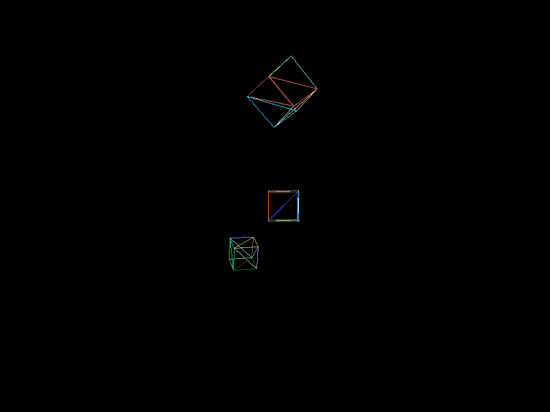

# Shit Game Engine Sample Project

De-coupling the "game" from my engine so I can sort of emulate how I think commercial engines are structured, as well as keep stuff kinda de-cluttered

Also kind of serves as a learning tool for Entity Component Systems as I'm trying to add a basic ECS structure to the engine

